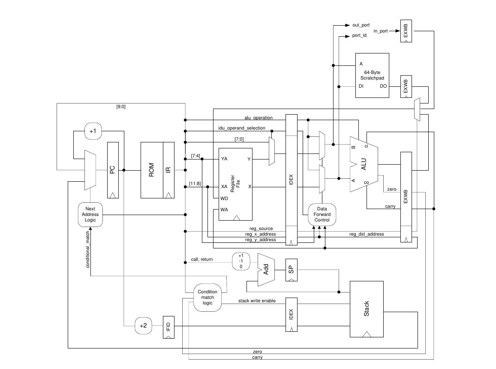

&nbsp;

&nbsp;

&nbsp;

&nbsp;

&nbsp;

&nbsp;

&nbsp;

    <header>
        <h1> 8-Bit Pipelined Picoblaze Validation Plan </>
        <h2> ECE-571 Fall </h2>
    </header>

&nbsp;

&nbsp;

<header >
    <h4> Aalap Khanolkar, aalap@pdx.edu </>
    <h4> Kathyayani Neerudi, kneerudi@pdx.edu </>
    <h4> Niko Nikolov, nnikolov@pdx.edu </>
    <h4> Date 11-26-22 </>
</header>

<!-- pagebreak -->
<header style="text-align: left">
 <h1> Table of contents </h1>
 </header>

<!-- vscode-markdown-toc -->

- [1. Introduction](#1-introduction)
- [2. Design Description](#2-design-description)
- [3. Coverage](#3-coverage)
- [4. Assertions](#4-assertions)
- [5. Unit Level Testing Plans](#5-unit-level-testing-plans)
  - [5.1. Instruction Fetch](#51-instruction-fetch)
  - [5.2. Instruction Decode](#52-instruction-decode)
  - [5.3. Instruction Execute](#53-instruction-execute)
    - [Validate Signals](#validate-signals)
    - [Validate Instructions](#validate-instructions)
    - [Validate Functionalities](#validate-functionalities)
  - [5.4. Memory Access](#54-memory-access)
  - [5.5. Write Back](#55-write-back)
- [6. Assertions Testing](#6-assertions-testing)
- [7. Test Plan Success Criteria](#7-test-plan-success-criteria)
- [8. Citations](#8-citations)

<!-- vscode-markdown-toc-config
	numbering=true
	autoSave=true
	/vscode-markdown-toc-config -->
<!-- /vscode-markdown-toc -->

<!-- pagebreak -->

## 1. Introduction

In brief, coverage includes three components:
(1) Code Coverage (which is structural) which needs to be 100 % .
(2) Functional Coverage that need to be designed to cover functionality (i.e. intent) of the entire design and must completely cover the design.
(3) Temporal domain coverage (using SVA ‘cover’ feature) which need to be carefully designed to fully cover all required temporal domain conditions
of the design. [1]

Traditional verification can be called Black Box verification with Black Box observability, meaning, you apply vectors/transactions at the primary input of the ‘block’ without caring for what’s in the block (blackbox verification) and you observe the behavior of the block only at the primary outputs (blackbox observability). Assertions on the other hand allow you to do black box verification with white box (internal to the block) observability. [1]

<figure>

<figcaption> Figure: Assertions for HW emulation [1] <figcaption>
</figure>

<figure>

<figcaption> Figure: Static Assertions for HW emulation [1] <figcaption>
</figure>

<!-- pagebreak -->

## 2. Design Description

<figure>

<figcaption> Figure: Picoblaze block diagram <figcaption>
</figure>

<figure>

<figcaption> Figure: Creating PSM file <figcaption>
</figure>

<figure>

<figcaption> Figure: Picoblaze ISA <figcaption>
</figure>

<figure>

<figcaption> Figure: Picoblaze ISA  <figcaption>
</figure>

<figcaption> Figure: Picoblaze ISA <figcaption>
</figure>

<figure>

<figcaption> Figure: Picoblaze Address Space <figcaption>
</figure>

<!-- pagebreak -->

## 3. Coverage

At the end we are targeting above 90% coverage.

<!-- pagebreak -->

## 4. Assertions

We will use System Verilog Assertion in our design.

<!-- pagebreak -->

## 5. Unit Level Testing Plans

### 5.1. Instruction Fetch

The test cases created for instruction fetch will mainly verify that the instructions are correctly fetched and also check if the program counter jumps to the target or increments, when the branch is taken or not taken respectively. Finally, we also check for rollover condition where the PC should rollback to the starting address when it goes out of bound. Assertions are created using expected outputs that are obtained from the register.

| Team Member | Design Unit | Test Name |
| :---------- | :---------- | :-------- |
| Kathy       | IF          | Reset -> Reset PC to 0, disable interrupts and clear flags |
|             | IF          | Branch Taken -> Check if PC jumps to target |
|             | IF          | Branch Not Taken -> Check if PC gets incremented |
| 	          | IF          | Roll Over -> Check if PC rolls over when crossing the Mem boundary |

<!-- pagebreak -->

### 5.2. Instruction Decode

Aalap is assigned the responsiblity of through ahd through testing of the decode unit. The approach used here is to verify the accurate functioning of the intruction decode procedure.
| Team Member | Design Unit | Test Name |
| :---------- | :---------- | :-------- |
| Aalap | ID | Check if ZERO flag is asserted |
| Aalap | ID | Check if CARRY flag is asserted |
| Aalap | ID | Test the Operand selection |
| Aalap | ID | Check for invalid instructions in IDU |
| Aalap | ID | Verify the condition match logic |

Aalap has discussed his initial plans here. But these plans are expected to change with more and more exploration of the architecture.

<!-- pagebreak -->

### 5.3. Instruction Execute

For each unit below would be performed a subset of tests.

#### Validate Signals

| Team Member | Design Unit | Test Name                     |
| :---------- | :---------- | :---------------------------- |
| Niko        | IE          | Validate reg_source           |
| Niko        | IE          | Validate reg_x_address        |
| Niko        | IE          | Validate reg_y_address        |
| Niko        | IE          | Validate reg_source           |
| Niko        | IE          | Validate idu_operand          |
| Niko        | IE          | Validate alu operation        |
| Niko        | IE          | Validate Data Forward Control |
| Niko        | IE          | Validate reg_dst_address      |
| Niko        | IE          | Validate Alu ADD              |
| Niko        | IE          | Validate X propagation        |
| Niko        | IE          | Validate Y propagation        |
| Niko        | IE          | Validate out_port             |
| Niko        | IE          | Validate port ID              |
| Niko        | IE          | Validate Y propagation        |
| Niko        | IE          | Validate out_port             |

#### Validate Instructions

For each instruction we will perform an assertion and unit test.

| Team Member | Design Unit | Test Name      |
| :---------- | :---------- | :------------- |
| Niko        | IE          | Validate AND   |
| Niko        | IE          | Validate ADDCY |
| Niko        | IE          | Validate STORE |
| Niko        | IE          | Validate SUB   |
| Niko        | IE          | Validate SUBCY |
| Niko        | IE          | Validate XOR   |
| Niko        | IE          | Validate OR    |
| Niko        | IE          | Validate Call  |
| Niko        | IE          | Validate XOR   |
| Niko        | IE          | Validate OR    |

#### Validate Functionalities

| Team Member | Design Unit | Test Name        |
| :---------- | :---------- | :--------------- |
| Niko        | IE          | Validate RESET   |
| Niko        | IE          | Validate COMPARE |

<!-- pagebreak -->

### 5.4. Memory Access

There are a specific set of points that need to be considered while accessing the memory.

a. When the writeback stage expects them, memory addresses should be available.

b. The instructions where memory access is not the requirement should be directly forwarded.
| Team Member | Design Unit | Test Name |
| :---------- | :---------- | :---------------------------------------------------------------------------------|
| Aalap | MA | Verify that the non-memory bound operations are forwarded with further processing |
| Aalap | MA | Check the boundaries of the scratchpad (64, 8-bit entries by default) |

<!-- pagebreak -->

### 5.5. Write Back

| Team Member | Design Unit | Test Name            |
| :---------- | :---------- | :------------------- |
| Niko        | WB          | Validate carry       |
| Niko        | WB          | Validate scratch pad |
| Niko        | WB          | Validate WB enabling |

<!-- pagebreak -->

## 6. Assertions Testing

We are planning to use asserions in the form of a black box. For the most part we have two goals in mind:

1. Validate singal propagation is accurate
2. Validate Instructions are doing what they supposed to be doing

<!-- pagebreak -->

## 7. Test Plan Success Criteria

<!-- pagebreak -->

## 8. Citations

[1]. Mehta, Ashok B. SystemVerilog Assertions and Functional Coverage Guide to Language, Methodology and Applications. Springer International Publishing, 2016.
